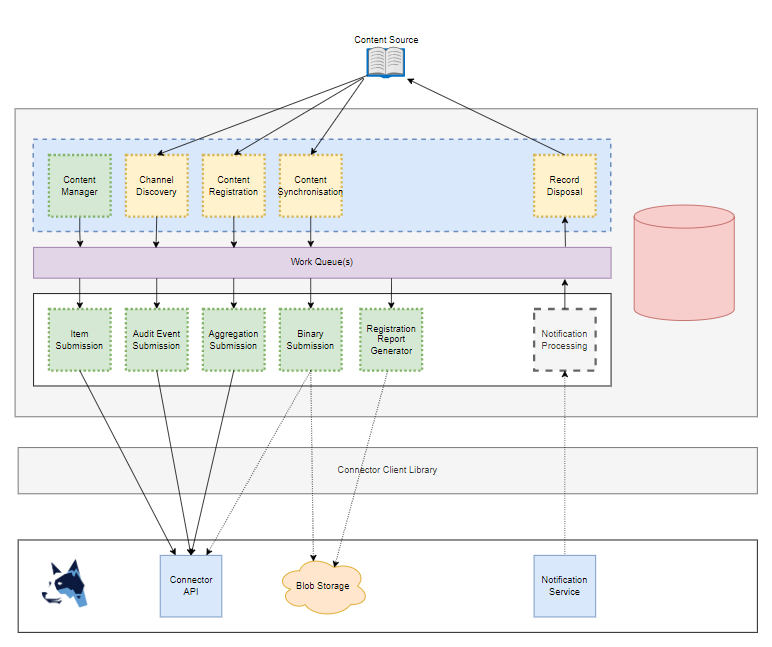

# Records365 Connectors SDK 

Get started quickly with writing new connectors for Records365 using this .NET library.

To jump straight in to building a Connector, see the [Quick Start Guide](./docs/quick_start.md).

## Overview 
The Records365 Connectors SDK has the following features:

*  Separate and invididually scalable responsiblities
*  Clearly defined interfaces for implementing record ingestion logic
*  Modularised and easily extendable
*  Utilises Dependecy Injection
*  Submits content to the Records365 Connector API with Back-Off & Retry logic
*  Receive notifications from Records365 (via webhook or by polling the Connector API)

The Connectors SDK is consists of numerous packages that provide various functionality as required by a connector.
It includes multiple resource provider implementations, giving you different options for building and deploying your connector.

## Versioning
This project uses [semantic versioning](https://semver.org/) which is automated through the build process.

Semantic Versioning: [MAJOR].[MINOR].[PATCH]

To increment various version segments, include "+semver: xxxx" in your PR description:
* MAJOR: use "+semver: major" or "+semver: breaking"
* MINOR: use "+semver: minor" or "+semver: feature"
* PATCH: use "+semver: patch" or "+semver: fix"

To explicitly set a version, tag the commit with the desired semantic version.


## Packages

*  [RecordPoint.Connectors.SDK](./docs/packages/recordpoint_connectors_sdk.md)
*  [RecordPoint.Connectors.SDK.Abstractions](./docs/packages/recordpoint_connectors_sdk_abstractions.md)
*  [RecordPoint.Connectors.SDK.Caching](./docs/packages/recordpoint_connectors_sdk_caching.md)
*  [RecordPoint.Connectors.SDK.Client](./docs/packages/recordpoint_connectors_sdk_client.md)
*  [RecordPoint.Connectors.SDK.Client.Abstractions](./docs/packages/recordpoint_connectors_sdk_client_abstractions.md)
*  [RecordPoint.Connectors.SDK.Configuration.AzurekeyVault](./docs/packages/recordpoint_connectors_sdk_configuration_azurekeyvault.md)
*  [RecordPoint.Connectors.SDK.ContentReport](./docs/packages/recordpoint_connectors_sdk_contentreport.md)
*  [RecordPoint.Connectors.SDK.Databases](./docs/packages/recordpoint_connectors_sdk_databases.md)
*  [RecordPoint.Connectors.SDK.Databases.AzureSql](./docs/packages/recordpoint_connectors_sdk_databases_azuresql.md)
*  [RecordPoint.Connectors.SDK.Databases.Cosmos](./docs/packages/recordpoint_connectors_sdk_databases_cosmos.md)
*  [RecordPoint.Connectors.SDK.Databases.LocalDb](./docs/packages/recordpoint_connectors_sdk_databases_localdb.md)
*  [RecordPoint.Connectors.SDK.Databases.PostgreSql](./docs/packages/recordpoint_connectors_sdk_databases_postgresql.md)
*  [RecordPoint.Connectors.SDK.Databases.Sqlite](./docs/packages/recordpoint_connectors_sdk_databases_sqlite.md)
*  [RecordPoint.Connectors.SDK.Health.Windows](./docs/packages/recordpoint_connectors_sdk_health_windows.md)
*  [RecordPoint.Connectors.SDK.Logging.Serilog](./docs/packages/recordpoint_connectors_sdk_logging_serilog.md)
*  [RecordPoint.Connectors.SDK.Notifications](./docs/packages/recordpoint_connectors_sdk_notifications.md)
*  [RecordPoint.Connectors.SDK.Toggles.LaunchDarkly](./docs/packages/recordpoint_connectors_sdk_toggles_launchdarkly.md)
*  [RecordPoint.Connectors.SDK.WebHost](./docs/packages/recordpoint_connectors_sdk_webhost.md)
*  [RecordPoint.Connectors.SDK.WorkQueue.AzureServiceBus](./docs/packages/recordpoint_connectors_sdk_workqueue_azureservicebus.md)

## What is a Connector?
Records 365 is a Data Intelligent platform that analyses content from external content sources and produces various meta data about the 
content that can then be used within an organisation for classification.

A Connector is a set of services that integrate the content source to Records 365. These services are broken up into functional domains
that implement a given responsibility covering various aspects such as content discovery and submission.



See the [operations documentation](./docs/operations/) for detailed information on services.

## How the Connectors SDK Works

### Background Services
The Connectors SDK consists of various [BackgroundService](https://docs.microsoft.com/en-us/dotnet/api/microsoft.extensions.hosting.backgroundservice) implementations that provide the main execution layer for the connector features.
These services can be included in your connector via dependency injction extentions available within the relevant SDK packages.

Each connector service typically implements logic that executes "Work Operations".

### Work
The Connectors SDK is based on a work system.
There are different types of work that are responsible for fulfilling the logic required by the varying aspects of a Connector.
Work typically contains a context for which the work is being executed within.

#### Work Operations
Each implementation for a type of work is a Work Operation.
Depending on the logic of a Work Operation, it can be derived from one of the following base Work classes:
*  `WorkBase<TParameter>`: Single execution Work that can be run immediately from within the calling service instance
*  `QueueableWorkBase<TParameter>`: Work that is submitted to a queue for one-time execution by any consuming service instance
*  `ManagedQueueableWorkBase<TConfiguration, TState>`: Work that is submitted to a queue for repeated executions over a long period of time

The Connectors SDK contains various 'Work Operation' implementations that provide the operational logic for the connector features.
These operations can be included in your connector via dependency injection extensions available within the relevant SDK packages.

For a detailed explanation of every Work Operation within the SDK, see [The Record Ingestion Process](./docs/operations/operations.md).

##### Queued Work Operations
Queued Work is a type of work that is submitted to a queue for future execution on any available instance of the relevant consuming service.
Each different type of work has its own queue on the underlying queueing resource so each connector responsbility can be self contained and independently scalable.

The Work Queue is implemented via the `RecordPoint.Connectors.SDK.WorkQueue.AzureServiceBus` package and uses Azure Service Bus as the underlying queueing resource.

The Work Queue is also implemented via the RecordPoint.Connectors.SDK.WorkQueue.RabbitMq and uses RabbitMq as an underlying queueing resource for On-Premise connector deployments.

##### Managed Queueable Work
See [Managed Work Queue](./docs/managedworkqueue.md)
The work operations that derive from `ManagedQueueableWorkBase` are operations that run within a defined context and share state between subsequent executions.

Executions should be quick and process a limited amount of information.
An instance of a work operation can be requeued within the same unmodifiable context, with modifiable state information being shared between executions.
When an operation is "continued", the work is resubmitted to the queue for execution at a later time based on configurable delay settings, including exponential back-off.

#### Work Actions
Some work operations have a related work action that is required to be implemented within your connector.
The work action is where you implement the logic to retrieve content/data from the content source for the given connector function, and return it to the SDK for processing.

### Configuration
There are various configurable options within the Connector SDK,  with each functional aspect of the Connector SDK having its own configuration options.

There are some global configuration settings (default values shown):
```json
"Connector": {
    "BinariesEnabled": true,
    "BinarySkipThreshold": 500,
    "SubmissionEnabled": true,
    "RetryOnFailure": true,
    "MaxRetries": 5,
    "RetryDelay": 30,
    "ExponentialRetryDelay": true
}
```

See [ConnectorOptions](./docs/packages/recordpoint_connectors_sdk_abstractions_doc.md?anchor=T-RecordPoint-Connectors-SDK-Connectors-ConnectorOptions)

### State Information
A database is used for storing state information such as connector configurations, work status, and channel information.

Some state information is also stored within work queue messages.

The SDK includes several different database providers allowing flexibility when implementing your Connector:
*  RecordPoint.Connectors.SDK.Databases.AzureSql
*  RecordPoint.Connectors.SDK.Databases.Cosmos
*  RecordPoint.Connectors.SDK.Databases.LocalDb
*  RecordPoint.Connectors.SDK.Databases.PostgreSql
*  RecordPoint.Connectors.SDK.Databases.Sqlite

### Integration with Records365
See [Record.Connectors.SDK.Notifications](./docs/packages/recordpoint_connectors_sdk_notifications.md)

Records365 generates notifications for connectors that can require the connector to perform some specified logic.
For example, connector configuration chnages (add,edit,delete) are received via notifications from Records365, and instruct the connector to apply the configuration change.

There are two ways to receive notifications from Records365.
You can instruct your connector to use either method by calling the relevant dependency injection extension from within the 'RecordPoint.Connectors.SDK.Notifications' package.

##### Push Notifications
Push notifications are implemented via a web-hook to the Connector.
Records365 will push notificatons directly to the Connector as they are generated.

##### Poll Notifications
Poll based notifications are implemented via a service that periodically calls the Records365 Connector Api.
The current implementation of poll based notifications is functionally limited in comparison to push notifications but can be used for development purposes.
